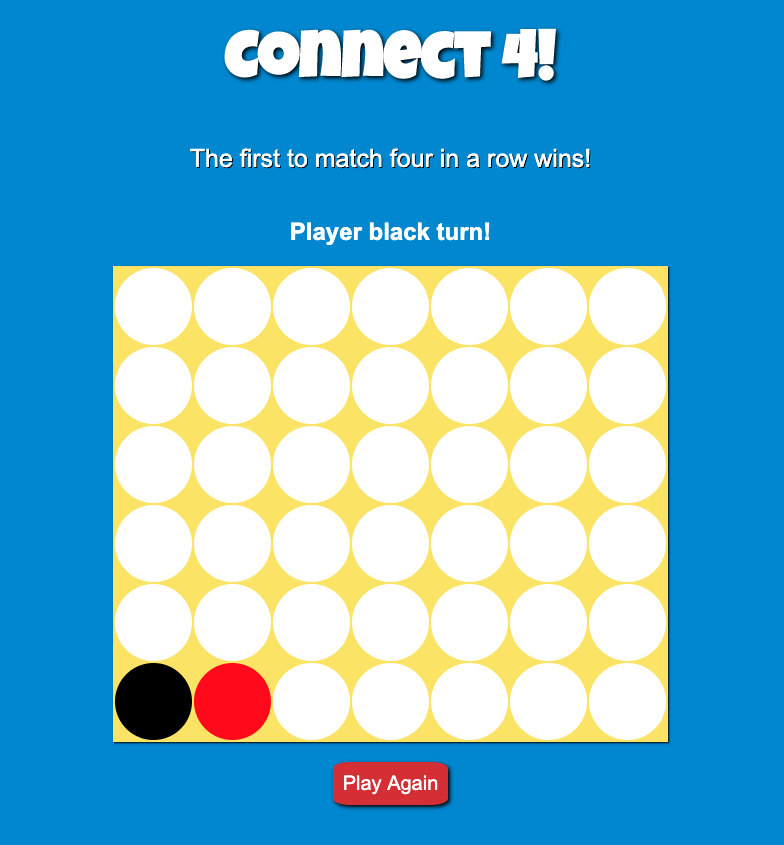

# My Game Project: Connect Four

### Description

Connect Four is a two player game that alternates turns. One player is the black token and the other player is the red token. The tokens are dropped starting at the top of each column and fall to the next available open spot. Once a player has four tokens in a row, vertically, horizontally, or diagonally the game has been won. If no one is able to place four tokens in a row, the game is done and no one has won. 

____

### Background

Connect Four was first sold by the game empire Milton Bradley in 1974. Long before it's publication some historians claim it was a beloved game of Captain Cook aboard his ship. The very first appearnce of the game is still disputed by many.

______

### Game Play Images

### Opening Screen

### Turns Are Indicated at Top of Screen

### The Winner is also Indicated

### Message for Ties

_____

## Technologies Used
* HTML
* CSS
* JavaScript

## Getting Started
To start the game click anywhere on the board for the first player's move.
<a href="https://jessicas131.github.io/Connect-Four-Game-/">Click here to play!</a>

## Next Steps
In the future I would like to add the following:

* Animations for the tokens to drop into place

* Sounds of the tokens dropping and celebration music when someone wins. 

* Enhance the graphic design for more of a vintage game effect 